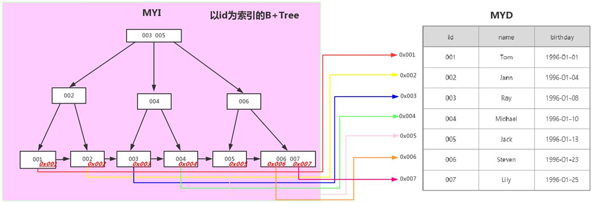

索引是存储引擎用来快速查找记录的一种数据结构，按照实现的方式类分，主要有Hash索引和B+Tree索引

按照功能划分，索引划为以下分类:

- 单列索引：一个索引只包含单个列，但一个表中可以有多个单列索引;
  - 普通索引：MySQL中基本索引类型，没有什么限制，允许在定义索引的列中插入重复值和空值，纯粹为了查询数据更快一点。
  - 唯一索引：唯一索引与前面的普通索引类似，不同的就是：索引列的值必须唯一，但允许有空值。如果是组合索引，则列值的组合必须唯一。它有以下几种创建方式：
  - 主键索引：每张表一般都会有自己的主键，当我们在创建表时，MySQL会自动在主键列上建立一个索引，这就是主键索引。主键是具有唯一性并且不允许为NULL，所以他是一种特殊的唯一索引。
- 组合索引：组合索引也叫复合索引，指的是我们在建立索引的时候使用多个字段，例如同时使用身份证和手机号建立索引，同样的可以建立为普通索引或者是唯一索引。复合索引的使用复合最左原则。
- 全文索引：全文索引主要用来查找文本中的关键字，而不是直接与索引中的值相比较，它更像是一个搜索引擎，基于相似度的查询，而不是简单的where语句的参数匹配。
- 空间索引：空间索引是对空间数据类型的字段建立的索引，MYSQL中的空间数据类型有4种，分别是GEOMETRY、POINT、LINESTRING、POLYGON。